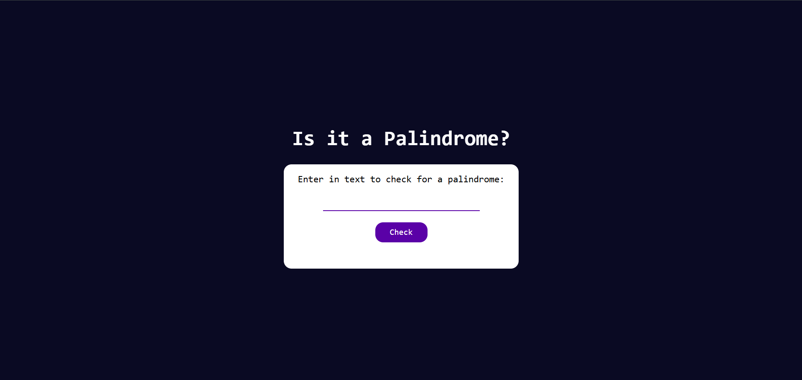

# Palindrome Checker

A simple web app that checks if a given text is a palindrome or not. It filters out spaces, punctuation, and is case-insensitive — then displays whether the cleaned string reads the same forwards and backwards.

**Link to project:** [https://ayushsaxena0.github.io/palindrome-checker/](https://ayushsaxena0.github.io/palindrome-checker/)

*Alt: Screenshot showing the palindrome checker UI with an input field and result section*

---

## How It's Made:

**Tech used:** HTML, CSS, JavaScript

This app was built from scratch using plain HTML, CSS, and JavaScript. I used a simple DOM event listener on a button to trigger the palindrome check. The JavaScript function processes the input by lowercasing it and filtering out non-alphanumeric characters. It then compares the cleaned string to its reverse to determine if it's a palindrome and updates the DOM with the result.

---

## Optimizations

I avoided regular expressions in favor of character filtering using `.includes()` for learning purposes. However, using a regex like `/[a-z0-9]/i` would improve performance and readability. Also, opening the result comparison in a more responsive design could help for mobile users.

---

## Lessons Learned:

This was a great project to brush up on DOM manipulation and array methods in JavaScript. I learned how to handle edge cases like empty inputs and how `reverse()` mutates the original array — which taught me to clone arrays when necessary using the spread operator (`[...]`). It was a small but satisfying project that gave immediate visual feedback.
